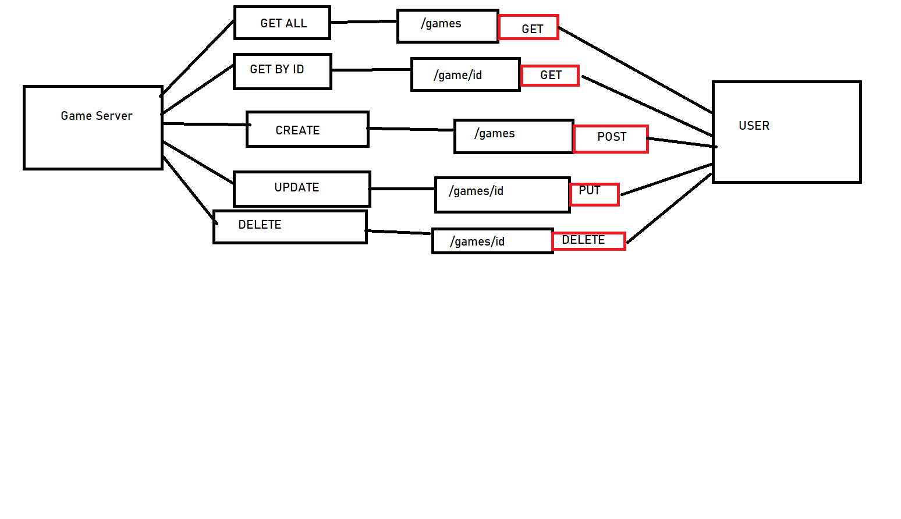

# Go Games API

## Table of Contents

1. [Project Overview](#project-overview)  
2. [Routes](#routes)  
3. [Architecture](#architecture)  
4. [Setup and Running](#setup-and-running)  

---

## Project Overview

The Go Games API is a simple RESTful API built with Go and Gorilla Mux that allows users to manage a collection of games. The API supports CRUD operations, enabling users to create, read, update, and delete game records.

### Features:
- **Retrieve all games** (`GET /games`)
- **Retrieve a specific game by ID** (`GET /games/{id}`)
- **Create a new game** (`POST /games`)
- **Update an existing game** (`PUT /games/{id}`)
- **Delete a game by ID** (`DELETE /games/{id}`)

---

## Routes

| **Method** | **Route**      | **Description**                      |
|------------|---------------|--------------------------------------|
| GET        | `/games`       | Returns a list of all games         |
| GET        | `/games/{id}`  | Returns details of a specific game  |
| POST       | `/games`       | Creates a new game                  |
| PUT        | `/games/{id}`  | Updates an existing game            |
| DELETE     | `/games/{id}`  | Deletes a game                      |

Each game has the following structure:
```json
{
  "id": "1",
  "gid": "48",
  "title": "Sekiro",
  "publisher": { "name": "FromSoft" }
}
```

---

## Architecture

The API is structured as follows:
1. **Request Handling**: Routes are managed using Gorilla Mux.
2. **Game Storage**: Games are stored in-memory using a slice of `Game` structs.
3. **CRUD Operations**: The API allows full management of game records through standard RESTful endpoints.

### Architecture Diagram


---

## Setup and Running

### Prerequisites
- Go installed (`go version` to check)
- Clone the repository

### Build and Run
1. **Build the server**:
   ```sh
   go build -o server
   ```
2. **Run the server**:
   ```sh
   ./server
   ```
3. **Access the API**:
   Open your browser or use Postman to test endpoints at `http://localhost:8000`

### Example API Calls
Retrieve all games:
```sh
curl -X GET http://localhost:8000/games
```
---